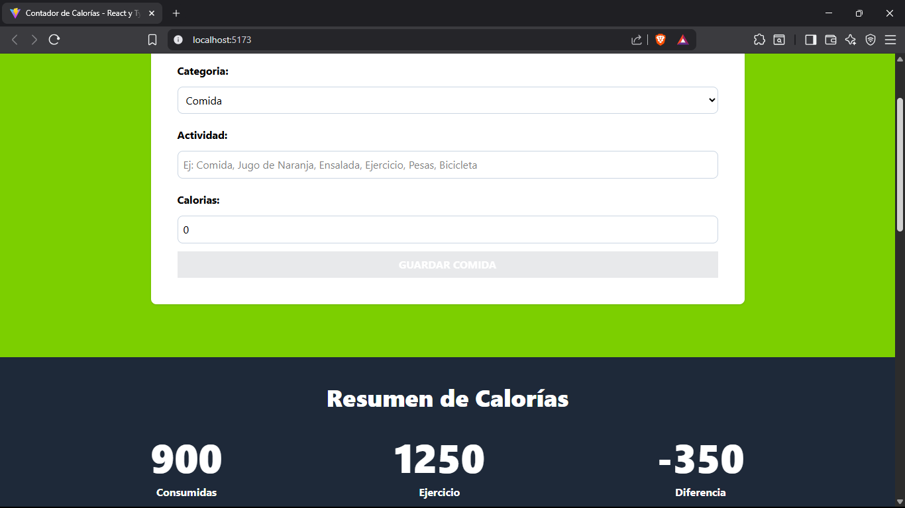

# Contador de Calorías

Proyecto de una aplicación para contar las calorías de las actividades (comida y ejercicio) y calcular la diferencia. Hecho con React+Vite, Tailwindcss, TypeScript, Local Storage para el almacenamiento en el cliente y useReducer para el manejo complejo de estados de los componentes.


## Demo 🚀

👉[Prueba el proyecto en vivo aquí](https://boisterous-kashata-fec8b1.netlify.app/)

## Screenshots




## Installation  and use

1. Clona el repositorio:

```bash
  git clone https://github.com/lautaroVal/contador-de-calorias.git
```
2. Navega al directorio del proyecto:

```bash
  cd contador-de-calorias
```
3. Instala las dependencias:

```bash
  npm install
```
4. Inicia la aplicación:

```bash
  npm run dev
```
5. Accede a la aplicación:
Abre tu navegador y navega a http://localhost:5173/ para interactuar con la aplicación.

## Main Features ✨

- Agregar alimentos y sus calorías.
- Visualizar una lista de entradas calóricas.
- Eliminar elementos de la lista.
- Ver el total de calorías consumidas.
- Diseño simple y directo, pensado para usabilidad rápida.

## Technologies used 🛠️

- **useReducer:** Para el manejo de estado complejo de una forma más estructurada y predecible que useState.
- **React y TypeScript:** Construcción del proyecto con React para una arquitectura basada en componentes y TypeScript para tipado estático, mejorando la capacidad de mantenimiento del código.
- **Tailwind CSS:** uso de Tailwind CSS para lograr un estilo que priorice la utilidad, lo que facilita la creación y el mantenimiento de un sistema de diseño consistente.
- **Local Storage:** almacenamiento de datos en el navegador para mantener la información de los usuarios.
